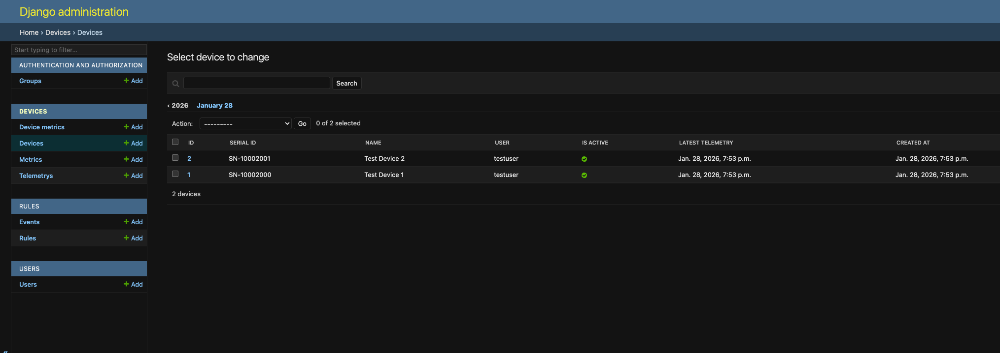
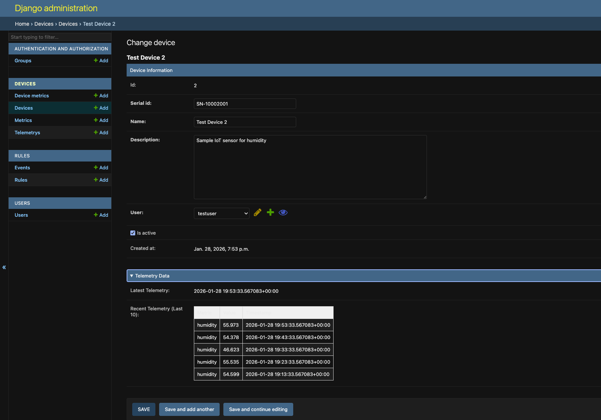
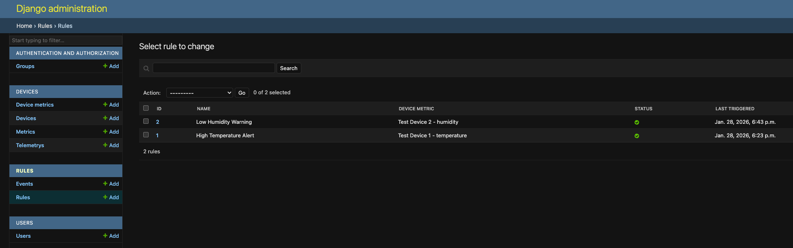

# Django Admin Guide

## Overview

This guide describes how to use the Django Admin interface for common IoT Hub workflows.

## Accessing Admin

1. Start the development server
2. Navigate to `http://localhost:8000/admin/`
3. Login with your credentials

### Default Development Users

Run `python manage.py setup_admin` to create default users:

| Username | Role | Capabilities |
|----------|------|--------------|
| superadmin | Superuser | Full access |
| admin_user | Admin | CRUD all models |
| operator_user | Operator | View + modify |
| viewer_user | Viewer | Read-only |

---

## Common Workflows

### 1. Create a New Device

1. Go to **Devices > Devices**
2. Click **Add Device** (top right)
3. Fill in:
   - **Serial ID**: Unique device identifier (e.g., `DEV-001`)
   - **Name**: Human-readable name
   - **Description**: Optional details
   - **User**: Select device owner
   - **Is active**: Check to enable
4. Click **Save**

### 2. View Recent Telemetry for a Device

**Option A: From Device detail page**
1. Go to **Devices > Devices**
2. Click on a device
3. Expand **Telemetry Data** section
4. View "Latest Telemetry" timestamp and "Recent Telemetry (Last 10)" table

**Option B: From Telemetry list**
1. Go to **Devices > Telemetrys**
2. Use search box to filter by device name
3. Use date hierarchy to filter by timestamp

### 3. Export Telemetry to CSV

1. Go to **Devices > Telemetrys**
2. Select telemetry records (checkbox)
3. From **Action** dropdown, select **Export selected telemetry to CSV**
4. Click **Go**
5. CSV file downloads automatically

### 4. Create/Edit Rules

**Create a new rule:**
1. Go to **Rules > Rules**
2. Click **Add Rule**
3. Fill in:
   - **Name**: Rule name (e.g., "High Temperature Alert")
   - **Description**: What the rule does
   - **Device metric**: Select target metric
   - **Condition**: JSON condition (e.g., `{"operator": ">", "value": 30}`)
   - **Action**: JSON action (e.g., `{"type": "alert", "message": "Temperature too high"}`)
   - **Is active**: Check to enable
4. Click **Save**

**Edit existing rule:**
1. Go to **Rules > Rules**
2. Click on rule name
3. Modify fields
4. Click **Save**

### 5. Inspect Events

1. Go to **Rules > Events**
2. View list with columns: Rule, Device, Acknowledged, Timestamp
3. Use filters:
   - **By rule**: Filter events for specific rule
   - **By timestamp**: Use date hierarchy
   - **By acknowledged**: Filter by status
4. Click on event ID for details

### 6. Acknowledge Events

**Single event:**
1. Go to **Rules > Events**
2. Click on event
3. Check **Acknowledged**
4. Click **Save**

**Bulk acknowledge:**
1. Go to **Rules > Events**
2. Select events (checkboxes)
3. From **Action** dropdown, select **Mark selected events as acknowledged**
4. Click **Go**

### 7. Enable/Disable Devices

**Single device:**
1. Go to **Devices > Devices**
2. Click on device
3. Toggle **Is active** checkbox
4. Click **Save**

**Bulk enable/disable:**
1. Go to **Devices > Devices**
2. Select devices (checkboxes)
3. From **Action** dropdown, select **Enable selected devices** or **Disable selected devices**
4. Click **Go**

---

## Admin Actions Reference

| Model | Action | Description |
|-------|--------|-------------|
| Device | Enable selected devices | Set `is_active=True` for selected |
| Device | Disable selected devices | Set `is_active=False` for selected |
| Telemetry | Export selected telemetry to CSV | Download CSV file |
| Event | Mark selected events as acknowledged | Set `acknowledged=True` |
| Event | Mark selected events as unacknowledged | Set `acknowledged=False` |

---

## Filtering and Search

### Device
- **Search**: serial_id, name, username, description
- **Filter**: is_active, created_at
- **Date hierarchy**: created_at

### Telemetry
- **Search**: device name
- **Filter**: timestamp, created_at, device_metric
- **Date hierarchy**: ts

### Rule
- **Search**: name, description, device name
- **Filter**: is_active, device_metric

### Event
- **Search**: rule name
- **Filter**: timestamp, created_at, rule, acknowledged
- **Date hierarchy**: timestamp

---

## Screenshots

### Device List View



### Device Detail with Telemetry Data



### Rule List View



---

# Admin Permissions and Roles

## Overview

This document describes the admin permission roles and their capabilities in the IoT Hub system.

## Role Definitions

### 1. Admin (Superuser)

**Django Settings:** `is_superuser=True`, `is_staff=True`

**Capabilities:**
- Full access to all admin functionality
- Create, read, update, delete all models
- Manage users and permissions
- Execute all admin actions (enable/disable devices, export CSV, acknowledge events)
- Access Django admin settings

### 2. Operator

**Django Settings:** `is_superuser=False`, `is_staff=True`

**Permissions:**
- `devices.view_device`, `devices.change_device`
- `devices.view_telemetry`
- `devices.view_metric`, `devices.view_devicemetric`
- `rules.view_rule`, `rules.change_rule`
- `rules.view_event`, `rules.change_event`

**Capabilities:**
- View and modify devices (enable/disable)
- View telemetry data and export to CSV
- View and modify rules (activate/deactivate)
- View and acknowledge events
- Cannot create or delete records
- Cannot manage users

### 3. Viewer (Read-Only)

**Django Settings:** `is_superuser=False`, `is_staff=True`

**Permissions:**
- `devices.view_device`
- `devices.view_telemetry`
- `devices.view_metric`, `devices.view_devicemetric`
- `rules.view_rule`
- `rules.view_event`

**Capabilities:**
- View all devices and their telemetry
- View rules and events
- Cannot modify any data
- Cannot execute admin actions
- Cannot export data

## Permission Matrix

| Action                     | Admin | Operator | Viewer |
|----------------------------|-------|----------|--------|
| View devices               | ✅    | ✅       | ✅     |
| Create/delete devices      | ✅    | ❌       | ❌     |
| Enable/disable devices     | ✅    | ✅       | ❌     |
| View telemetry             | ✅    | ✅       | ✅     |
| Export telemetry to CSV    | ✅    | ✅       | ❌     |
| View rules                 | ✅    | ✅       | ✅     |
| Create/edit rules          | ✅    | ✅       | ❌     |
| Delete rules               | ✅    | ❌       | ❌     |
| View events                | ✅    | ✅       | ✅     |
| Acknowledge events         | ✅    | ✅       | ❌     |
| Manage users               | ✅    | ❌       | ❌     |

## Creating Roles via Django Admin

1. Go to **Authentication and Authorization > Groups**
2. Create groups: `Operators`, `Viewers`
3. Assign permissions as listed above
4. Add users to appropriate groups

## Creating Roles via Management Command

```bash
python manage.py create_admin_groups
