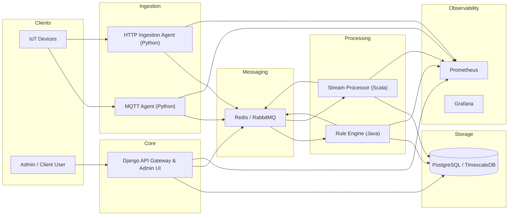

# IoT Catalog Hub - Architecture (MVP)

## 1. Architecture Overview

The IoT Catalog Hub MVP is implemented as a **monolithic core application** with supporting processing components, all deployed together in a single Docker Compose stack.

The architecture is designed to:

* Validate end-to-end IoT data flows
* Support device registration, telemetry ingestion, rule evaluation, and message routing
* Provide observability and operational transparency
* Serve as a foundation for a future microservices split

The MVP prioritizes **clarity, debuggability, and local reproducibility** over horizontal scalability.

---

## 2. High-Level Architecture Description

### Core Components

#### Django API Gateway & Admin UI

* Acts as the primary entry point for clients
* Provides REST APIs for:

  * Device registry
  * Telemetry ingestion
  * Rule management
  * User and role management
* Hosts the Django Admin UI for operational control
* Handles authentication and authorization (JWT + admin auth)

#### Telemetry Ingestion Agents (Python)

* Accept telemetry via:

  * MQTT
  * HTTP
* Validate and normalize incoming telemetry payloads
* Publish telemetry messages to the message broker

#### Rule Evaluation Service (Java)

* Consumes telemetry events from the message broker
* Evaluates trigger-based rules (thresholds, conditions)
* Emits rule-triggered events back to the broker

#### Streaming & Aggregation Service (Scala)

* Consumes telemetry streams
* Performs basic aggregations and stream processing
* Publishes aggregated results or derived events

#### Message Broker (Redis / RabbitMQ)

* Serves as the asynchronous backbone of the system
* Decouples ingestion, rule evaluation, and downstream processing
* Carries telemetry events and rule-triggered messages

---

## 3. Data Storage

### PostgreSQL / TimescaleDB

* Stores:

  * Device metadata
  * User and role data
  * Rule definitions
  * Time-series telemetry data
* Acts as the single source of truth for the MVP
* Schema managed via Django migrations

---

## 4. Observability and Operations

### Prometheus

* Scrapes metrics from:

  * Django API
  * Telemetry ingestion agents
  * Rule evaluation service
  * Streaming service
* Collects system and application-level metrics

### Grafana

* Provides dashboards for:

  * Telemetry ingestion rates
  * API request latency
  * Rule execution counts and failures
  * System health indicators

### Logging

* All services log to stdout/stderr
* Logs are collected and accessed via Docker Compose tooling

---

## 5. Deployment Model (MVP)

* All components are deployed via **Docker Compose**
* Single logical environment for local development and staging
* Environment-specific configuration provided via `.env` files
* No external service dependencies required for MVP validation

---

## 6. Architecture Diagram (Mermaid)

Below is the **authoritative MVP architecture diagram**.
This diagram reflects only components that will be (are) implemented in development stack.

---

## 7. Exported Diagram Artifact

The Mermaid diagram has been exported and committed in both formats. Click to open:

* [SVG version](images/mvp-architecture.svg)
* [PNG version](images/mvp-architecture.png)

Both files match the Mermaid source above and accurately reflect the implemented MVP stack. They can be used in documentation, presentations, or any tooling that requires a visual representation of the architecture.

---

## 8. Notes on Future Evolution

* This architecture intentionally mirrors future microservices boundaries:

  * API Gateway & Auth
  * Device Registry
  * Telemetry Ingestion
  * Rule Engine
  * Streaming & Aggregation
* The MVP does not enforce strict service isolation.
* Service extraction will occur only after the microservices readiness criteria are met.
