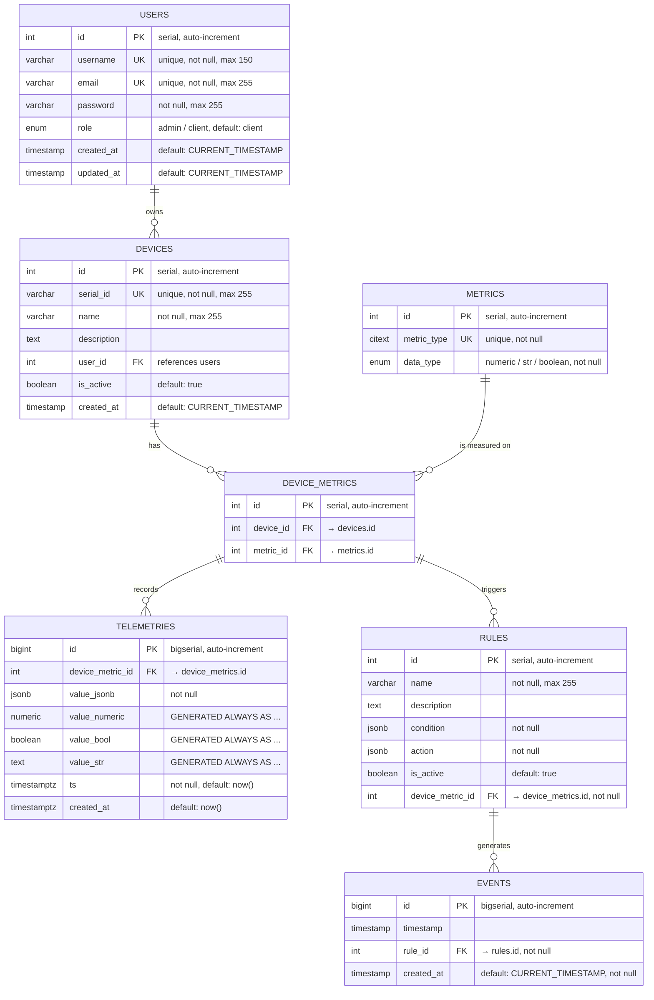

### Database Schema

## Recommended Indexes

| Table            | Index name                          | Columns                          | Type       | Purpose / Accelerated queries                                      |
|------------------|-------------------------------------|----------------------------------|------------|--------------------------------------------------------------------|
| users            | idx_users_role                      | role                             | normal     | Filtering by role (admin vs client)                                |
| devices          | idx_devices_user_id                 | user_id                          | normal     | Fast lookup of devices per user                                    |
| devices          | idx_devices_is_active               | is_active                        | normal     | Filtering active/inactive devices                                  |
| device_metrics   | uq_device_metric                    | device_id, metric_id             | **unique** | Prevent duplicate metric assignments per device                    |
| device_metrics   | idx_device_metrics_device           | device_id                        | normal     | Quick access to all metrics of a device                            |
| device_metrics   | idx_device_metrics_metric           | metric_id                        | normal     | Quick access to devices measuring a specific metric                |
| rules            | idx_rules_device_metric             | device_metric_id                 | normal     | Find rules for specific device+metric                              |
| rules            | idx_rules_is_active                 | is_active                        | normal     | Filter active rules quickly                                        |
| events           | idx_events_timestamp                | timestamp                        | normal     | Time-range queries, sorting events by time                         |
| events           | idx_events_rule                     | rule_id                          | normal     | Find all events triggered by a rule                                |
| telemetries      | unique_telemetry_per_metric_time    | device_metric_id, ts             | **unique** | Prevent duplicate measurements at same timestamp                   |
| telemetries      | idx_telemetries_metric_time         | device_metric_id, ts             | normal     | Fast time-series queries per metric (most frequent access pattern) |
| telemetries      | idx_telemetries_timestamp           | ts                               | normal     | Global time-range queries across all telemetry                     |

# DBML LINK
https://dbdiagram.io/d/IoT-db-696d114dd6e030a0245f8e22
