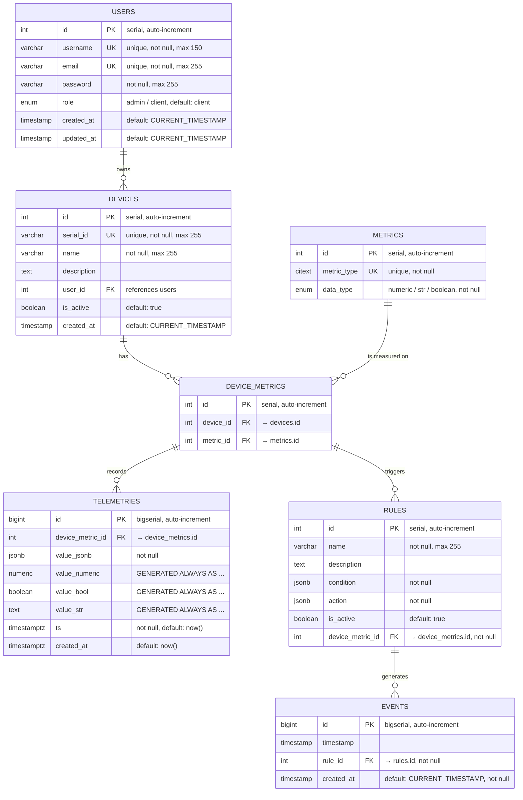

# Database Schema



## Recommended Indexes

| Table            | Index name                          | Columns                          | Type       | Purpose / Accelerated queries                                      |
|------------------|-------------------------------------|----------------------------------|------------|--------------------------------------------------------------------|
| users            | idx_users_role                      | role                             | normal     | Filtering by role (admin vs client)                                |
| devices          | idx_devices_user_id                 | user_id                          | normal     | Fast lookup of devices per user                                    |
| devices          | idx_devices_is_active               | is_active                        | normal     | Filtering active/inactive devices                                  |
| device_metrics   | uq_device_metric                    | device_id, metric_id             | **unique** | Prevent duplicate metric assignments per device                    |
| device_metrics   | idx_device_metrics_device           | device_id                        | normal     | Quick access to all metrics of a device                            |
| device_metrics   | idx_device_metrics_metric           | metric_id                        | normal     | Quick access to devices measuring a specific metric                |
| rules            | idx_rules_device_metric             | device_metric_id                 | normal     | Find rules for specific device+metric                              |
| rules            | idx_rules_is_active                 | is_active                        | normal     | Filter active rules quickly                                        |
| events           | idx_events_timestamp                | timestamp                        | normal     | Time-range queries, sorting events by time                         |
| events           | idx_events_rule                     | rule_id                          | normal     | Find all events triggered by a rule                                |
| telemetries      | unique_telemetry_per_metric_time    | device_metric_id, ts             | **unique** | Prevent duplicate measurements at same timestamp                   |
| telemetries      | idx_telemetries_metric_time         | device_metric_id, ts             | normal     | Fast time-series queries per metric (most frequent access pattern) |
| telemetries      | idx_telemetries_timestamp           | ts                               | normal     | Global time-range queries across all telemetry                     |


## DBML LINK
https://dbdiagram.io/d/IoT-db-696d114dd6e030a0245f8e22

---

## TimescaleDB Hypertable Setup
To optimize the storage of high-frequency telemetry data, we use **TimescaleDB Hypertables**. This partitions the telemetry data by time, ensuring fast queries even with millions of records.

### Automated Setup
By default, you do **not** need to run this command manually. The hypertable creation script is integrated into the `entrypoint.sh` and executes automatically every time the `web` container starts, immediately after migrations are applied.

### Manual Execution
If you need to manually trigger the hypertable creation (e.g., after database maintenance or if you've manually cleared the database schema), use the following management command:

```bash 
docker compose exec web python manage.py setup_timescaledb
```

---

## Example Common Query & EXPLAIN ANALYZE

#### Query Optimization for Telemetry Data

This document demonstrates how the `telemetries` table is optimized for common IoT use cases using TimescaleDB hypertable partitioning, indexes, and compression.

#### Table Optimization Summary

- **Hypertable partitioning**: by `ts` (7-day chunks)
- **Indexes**:
  - `idx_telemetries_metric_time` (device_metric_id, ts)
  - `idx_telemetries_timestamp` (ts)
- **Constraint**:
  - UNIQUE (device_metric_id, ts) — prevents duplicate measurements for the same metric at the same time
- **Compression**: enabled for chunks older than 30 days (segment by `device_metric_id`, order by `ts DESC`)
- **Retention**: data older than 1 year is automatically dropped

All examples below were executed on a database with seeded test data (January 23, 2026).

#### 1. Last 100 measurements for a specific metric (by device_metric_id)

**Query**:

```sql
EXPLAIN ANALYZE
SELECT 
    ts,
    value_numeric,
    value_bool,
    value_str
FROM telemetries
WHERE device_metric_id = 123
ORDER BY ts DESC
LIMIT 100;
```
**EXPLAIN ANALYZE output**
```
Limit  (cost=4.47..4.48 rows=3 width=61) (actual time=0.812..0.823 rows=0 loops=1)
   ->  Sort  (cost=4.47..4.48 rows=3 width=61) (actual time=0.811..0.821 rows=0 loops=1)
         Sort Key: _hyper_1_1_chunk.ts DESC
         Sort Method: quicksort  Memory: 25kB
         ->  Bitmap Heap Scan on _hyper_1_1_chunk  (cost=1.27..4.45 rows=3 width=61) (actual time=0.098..0.108 rows=0 loops=1)
               Recheck Cond: (device_metric_id = 123)
               ->  Bitmap Index Scan on _hyper_1_1_chunk_telemetries_device_metric_id_dffeeb4b  (cost=0.00..1.27 rows=3 width=0) (actual time=0.095..0.105 rows=0 loops=1)
                     Index Cond: (device_metric_id = 123)
 Planning Time: 11.316 ms
 Execution Time: 1.170 ms
 ```
 **This query is optimized by:**

1. Using the composite index `idx_telemetries_metric_time` (device_metric_id, ts) to instantly filter by metric and enable backward scan for newest-first order  
2. Leveraging TimescaleDB chunk exclusion — only relevant time chunks are considered  
3. Early termination when no matching rows exist — no chunk scan or JSONB decompression needed

 #### 2. Recent measurements with device name, metric type, and values
 
 ```sql
    EXPLAIN ANALYZE
    SELECT 
        d.serial_id,
        d.name AS device_name,
        m.metric_type AS metric_type,
        t.ts,
        t.value_numeric,
        t.value_bool,
        t.value_str
    FROM telemetries t
    JOIN device_metrics dm ON t.device_metric_id = dm.id
    JOIN devices d ON dm.device_id = d.id
    JOIN metrics m ON dm.metric_id = m.id
    WHERE d.id = 789                           
    AND t.ts >= NOW() - INTERVAL '24 hours'
    ORDER BY t.ts DESC;
 ```
**EXPLAIN ANALYZE output**
 ```
Sort  (cost=23.89..23.89 rows=1 width=1311) (actual time=0.456..0.472 rows=0 loops=1)
   Sort Key: t.ts DESC
   Sort Method: quicksort  Memory: 25kB
   ->  Nested Loop  (cost=1.78..23.88 rows=1 width=1311) (actual time=0.373..0.389 rows=0 loops=1)
         ->  Nested Loop  (cost=1.63..22.71 rows=1 width=1097) (actual time=0.372..0.388 rows=0 loops=1)
               ->  Nested Loop  (cost=1.49..20.34 rows=1 width=69) (actual time=0.372..0.387 rows=0 loops=1)
                     ->  Bitmap Heap Scan on device_metrics dm  (cost=1.33..8.57 rows=10 width=12) (actual time=0.371..0.385 rows=0 loops=1)
                           Recheck Cond: (device_id = 789)
                           ->  Bitmap Index Scan on device_metrics_device_id_aedc7780  (cost=0.00..1.33 rows=10 width=0) (actual time=0.368..0.381 rows=0 loops=1)
                                 Index Cond: (device_id = 789)
                     ->  Custom Scan (ChunkAppend) on telemetries t  (cost=0.15..1.17 rows=1 width=65) (never executed)
                           Order: t.device_metric_id
                           Chunks excluded during startup: 0
                           ->  Index Scan using _hyper_1_1_chunk_idx_telemetries_metric_time on _hyper_1_1_chunk t_1  (cost=0.15..1.17 rows=1 width=65) (never executed)
                                 Index Cond: ((device_metric_id = dm.id) AND (ts >= (now() - '24:00:00'::interval)))
               ->  Index Scan using devices_pkey on devices d  (cost=0.14..2.36 rows=1 width=1036) (never executed)
                     Index Cond: (id = 789)
         ->  Index Scan using metrics_pkey on metrics m  (cost=0.15..1.16 rows=1 width=222) (never executed)
               Index Cond: (id = dm.metric_id)
 Planning Time: 35.270 ms
 Execution Time: 1.308 ms
 ```
 **This query is optimized by:**

1. Starting with bitmap index scan on `device_metrics` (device_id index) — immediately detects no metrics for the device  
2. Early termination by PostgreSQL planner — skips scanning the `telemetries` hypertable and its chunks entirely (never executed on ChunkAppend)  
3. Primary key lookups for joins to `devices` and `metrics` — negligible cost even when data exists


---

## Database Backup and Recovery Manual

This guide provides instructions for creating database snapshots, automating the backup process, and verifying data integrity


### 1. Manual Backup (Custom Format)

**To create a manual backup:**

```bash
# 1. Ensure the backup directory exists on your host machine
mkdir -p backups

# 2. Run the dump command
# The output is redirected to a file on your host machine
docker compose exec -T db pg_dump \
  -U iot_user_db -d iot_hub_db \
  --format=custom \
  --no-owner --no-privileges \
  > backups/iot_hub_$(date +%Y%m%d_%H%M%S).dump
```

### 2. Restore Procedure
To restore data from a .dump file, we use pg_restore. 

**To restore into a test database:**

```bash
# 1. Create a clean database for verification
docker compose exec db psql -U iot_user_db -d postgres -c "DROP DATABASE IF EXISTS iot_db_test;"
docker compose exec db psql -U iot_user_db -d postgres -c "CREATE DATABASE iot_db_test;"

# 2. Enable TimescaleDB to restore
docker compose exec db psql -U iot_user_db -d iot_db_test \
  -c "CREATE EXTENSION IF NOT EXISTS timescaledb CASCADE;"


# 3. Restore the data (using 4 parallel jobs for better performance)
docker compose exec -i -T db pg_restore \
  -U iot_user_db \
  -d iot_db_test \
  --no-owner \
  --no-privileges \
  < backups/snapshot_20260124_022006.dump #set your backup file name
```


[!IMPORTANT] Note the -i flag and the < operator. This pipes the file from your host machine into the Docker container.

### 3. Automated Daily Backup Script
Save the following script as scripts/backup_db.sh in your project root.

```bash
#!/bin/bash
set -euo pipefail

# --- Configuration ---
BACKUP_DIR="./backups"
DB_NAME="iot_hub_db"
DB_USER="iot_user_db"
TIMESTAMP=$(date +%Y%m%d_%H%M%S)
BACKUP_FILE="$BACKUP_DIR/snapshot_$TIMESTAMP.dump"

# Create directory if it doesn't exist
mkdir -p "$BACKUP_DIR"

echo "Starting database backup for $DB_NAME..."

# Execute dump
docker compose exec -T db pg_dump \
  -U "$DB_USER" -d "$DB_NAME" \
  --format=custom \
  --no-owner --no-privileges \
  > "$BACKUP_FILE"

echo "Backup created successfully: $BACKUP_FILE"
echo "Size: $(du -h "$BACKUP_FILE" | cut -f1)"

# --- Cleanup ---
# Remove backups older than 7 days to save disk space
find "$BACKUP_DIR" -name "snapshotш*.dump" -mtime +7 -delete
echo "Old backups (older than 7 days) have been removed."
```

Setup instructions:
* Make it executable: `chmod +x scripts/backup_db.sh`
* Run manually: `./scripts/backup_db.sh`


### 4. Scheduling with Cron
To automate backups on a server, add the script to the system's `crontab`.
* Open crontab: `crontab -e`
* Add the following line (runs daily at 7:00 AM):
```bash
0 7 * * * cd /path/to/your/project && ./scripts/backup_db.sh >> backups/backup.log 2>&1
```
* `:wq` to save 
